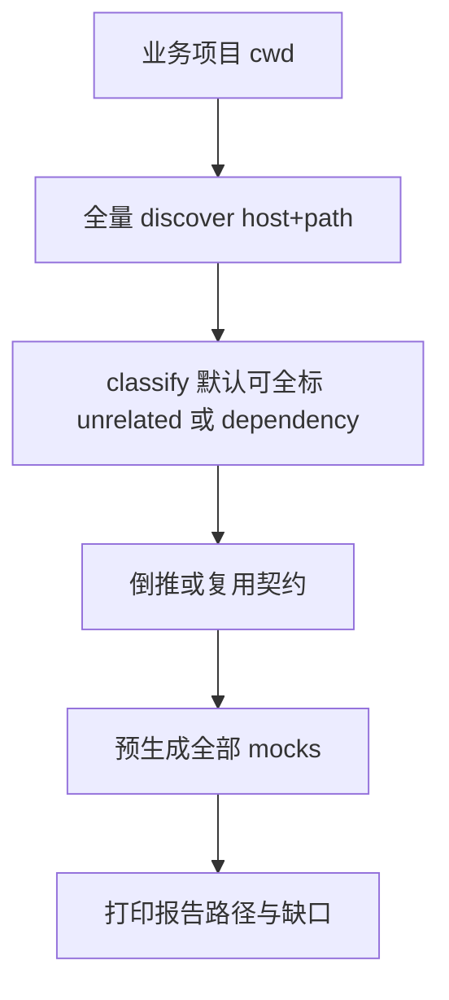
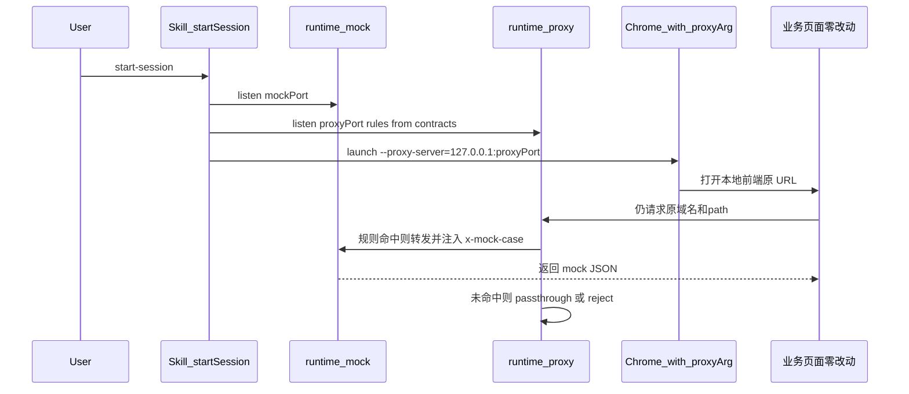
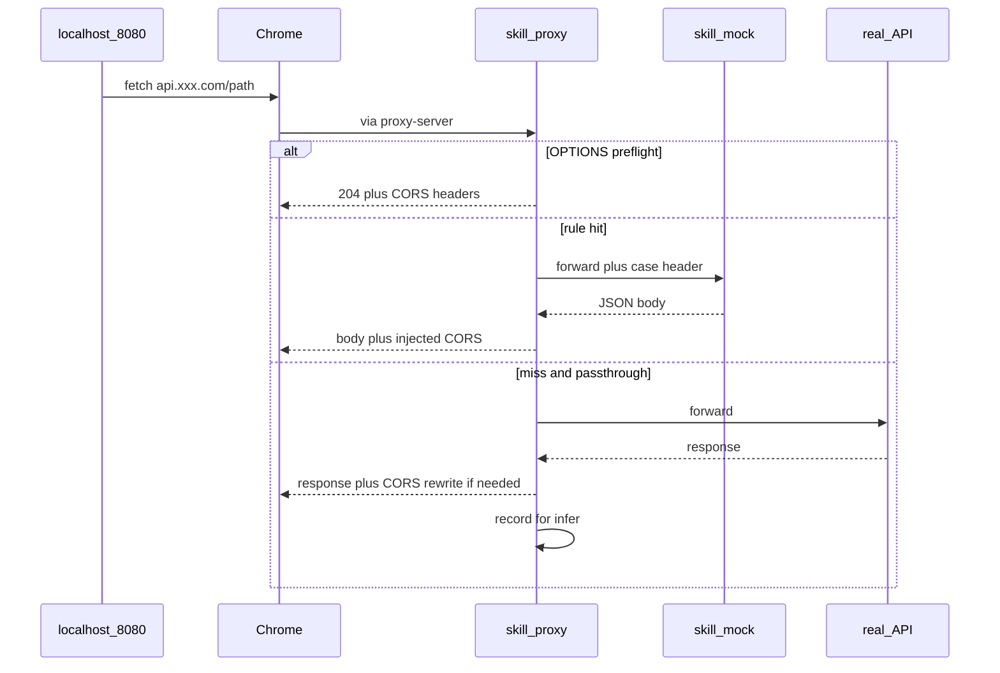
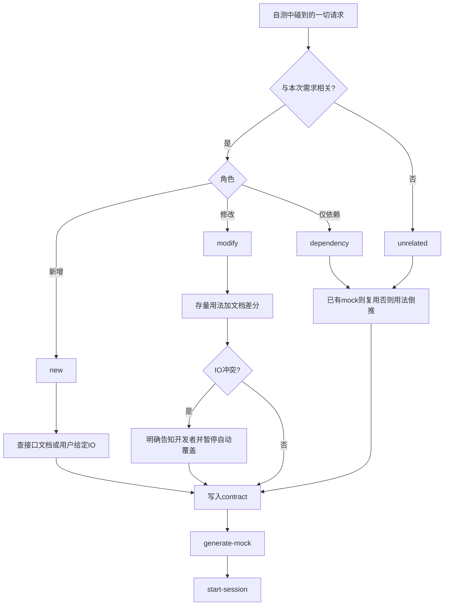

# Mock Skill：内置 Mock 运行时 + 自带可开关代理

## 决策锁定

| 项 | 选择 |
|----|------|
| 项目根 / Git | **`/Users/xuwei/Profession/mock`**（独立 git 仓库；当前目录已存在且为空） |
| Skill 发现 | 仓库即 skill 根（含 `SKILL.md`）；安装时 symlink 到 `~/.agents/skills/api-mock-orchestrator` → 本仓库，供 Cursor/Agent 发现 |
| Mock 运行时 | **内置在本仓库** `runtime/mock-server`（蒸馏自 Guazi mock-server，运行时不依赖该仓） |
| Guazi mock-server | 参考实现 / 迁移样例源，非运行时真源 |
| 会话数据 | **扁平**：`.data/projects/<projectSlug>/`（一项目一份契约/mock，不按 task 分层）；Chrome 在 `.data/chrome-profiles/<projectSlug>/` |
| 代理 | 仓库内 `runtime/proxy`；不依赖 Whistle/Charles 等 |
| 开关与端口 | 配置 + CLI；`mockPort` / `proxyPort` / `proxy.enabled` 可配 |
| 业务仓 | 零侵入：不改业务代码 / MSW / vite proxy |
| CLI | 全局命令 **`mock-skill`**；一键安装；项目内 **`mock-skill init` 预生成全量接口 mock** |

---

## 一键安装与 CLI（`init` 预生成）

### 一键安装

仓库提供可复制命令（写入 README 置顶）：

```bash
# 推荐：本地仓已存在时
/Users/xuwei/Profession/mock/scripts/install.sh

# 等价能力
cd /Users/xuwei/Profession/mock && npm install && npm link
# 并 symlink Agent skill：
ln -sfn /Users/xuwei/Profession/mock ~/.agents/skills/api-mock-orchestrator
```

`scripts/install.sh` 必须完成：

1. `npm install`（根 `package.json`）
2. `npm link`（或把 `bin/mock-skill` 链到可执行 PATH）
3. symlink → `~/.agents/skills/api-mock-orchestrator`
4. 探测 Node 版本；打印 `mock-skill --help` 与下一步 `cd <业务项目> && mock-skill init`

`package.json`：

```json
{
  "name": "mock-skill",
  "bin": { "mock-skill": "./bin/mock-skill.js" }
}
```

卸载：`mock-skill uninstall` 或 `scripts/uninstall.sh`（unlink + 可选删 symlink）。

### 全局 CLI 子命令（定稿）

| 命令 | 作用 |
|------|------|
| `mock-skill install` / `scripts/install.sh` | 一键安装（见上） |
| **`mock-skill init [projectDir]`** | **在业务项目中预生成该项目扫描到的全部接口 mock**（默认 cwd） |
| `mock-skill classify` | 对已 discover 清单跑分类（可并入 init） |
| `mock-skill generate` | 仅按已有 contract 生成/更新 mock |
| `mock-skill session start\|stop` | 起停内置 mock+proxy |
| `mock-skill set-case` | 切换 case |
| `mock-skill smoke` | 冒烟 |
| `mock-skill audit --task=...` | 按需求 ID 查 changelog / 追因（不对应独立 mock 目录） |

### `mock-skill init` 行为（核心）

在**业务项目根**执行（例：`cd ~/Guazi/foo-web && mock-skill init`）：



1. **定位项目**：`projectDir` 默认 `process.cwd()`；算出 `projectSlug`（规则见下节）。
2. **全量扫描**：扫前端源码树，产出该项目**全部**可识别接口。
3. **落盘**：契约与 mock **只写** `.data/projects/<projectSlug>/`（见下节，**不按 task 分层**）。
4. **分类 + 溯源**：`--task=<需求ID>` **必选于需求自测场景（推荐）**，用于标注「这次改动/这次操作属于哪个需求」，写入日志与契约元数据，便于后续查询追因；**不**因此拆分 mock 目录。契约更新仍原地写该项目唯一那份。
5. **零侵入业务仓**：默认不写业务仓；可选 `--write-project-config`。
6. **报告 / 审计日志**：见下「`--task` 溯源约定」。
7. **幂等**：再次 `init` 默认 merge；`--force` 重建。

```bash
/Users/xuwei/Profession/mock/scripts/install.sh
cd /path/to/frontend-app
mock-skill init
mock-skill init --task=TR-1234 --related-from=docs/req.md
mock-skill session start --task=TR-1234
```

---

### `.data` 路径规则（扁平，一项目一份）

**原则：** 一个业务项目里，每个接口（`host+path`）只有一份契约/mock。任务改了接口，所有调用方共用更新——**不做 task 目录分层**。

```
/Users/xuwei/Profession/mock/.data/
├── chrome-profiles/<projectSlug>/
└── projects/<projectSlug>/
    ├── contracts/
    ├── mocks/<host>/<path>/index.js
    ├── classify/request-roles.json
    ├── captures/
    ├── reports/
    ├── audit/changelog.jsonl      # 按 task 可查的追因日志
    └── session.json
```

| 段 | 生成规则 |
|----|----------|
| `projectSlug` | `--name` → `package.json` name（去 `@scope/`，非法字符→`-`）→ 否则 `basename(projectDir)` |
| 工作区 | 固定唯一：`.data/projects/<projectSlug>/` |
| 接口唯一键 | `host + method + path`；modify 原地更新 |
| Chrome profile | `.data/chrome-profiles/<projectSlug>/` |

**已废弃：** `_project/`、`tasks/<taskId>/` 作为 mock/契约存储路径。

### `--task` 溯源约定（不做存储分层）

| 写入位置 | 内容 |
|----------|------|
| `contracts/*.json` 元数据 | `lastTaskId` / `history[]`：`{ taskId, role, at, action: create\|update\|reuse }` |
| `audit/changelog.jsonl` | 一行一事：时间、taskId、命令（init/generate/session/set-case）、接口键、role、结果摘要 |
| `reports/*-<taskId>-*.md` | 本次需求的分类/冲突/init 报告（文件名带 task，目录仍在项目 `reports/`） |
| proxy / session 日志 | 每条 access log 带 `taskId`（来自当前 session），便于对照「哪次需求自测打出的流量」 |

查询示例（实现后文档化）：

```bash
mock-skill audit --task=TR-1234          # 过滤 changelog
mock-skill audit --api=host/path         # 看该接口被哪些 task 改过
```

无 `--task` 时：仍可 init/session，changelog 记 `taskId: null` 或 `adhoc`；**不阻断**，但 Skill 在「需求自测」话术下应提醒补上 task 以便追因。

---

## Git 与目录归属

- **源码进 git**：`SKILL.md`、`references/`、`runtime/`、`scripts/`、`assets/`、`config/default.session.json`、`package.json`、`README.md`。
- **不进 git**（`.gitignore`）：`node_modules/`、`.data/`（contracts 工作副本、mocks 生成物、captures、reports、chrome-profiles、session pid）、`*.log`、本地覆盖 `session.local.json`。
- **可选进 git**：`assets/examples/` 下脱敏 golden 样例；真实业务契约默认留在 `.data/`。
- 初始化：`git init`于 `/Users/xuwei/Profession/mock`，首提交在用户明确要求 commit 时再做（实现阶段可先建文件）。
- Agent 发现：`ln -sfn /Users/xuwei/Profession/mock ~/.agents/skills/api-mock-orchestrator`（文档写入 README；实现 Phase 0 执行或打印该命令）。

---

## 相对早期草案的变更摘要

1. 落点从 `~/.agents/skills/...` 改为 **`/Users/xuwei/Profession/mock` + git**；agents 路径仅作 symlink。
2. 取消对 Whistle/Charles 依赖；代理与 mock 均在仓库内。
3. 会话数据默认 `.data/`，不再默认写 `~/.api-mock`（仍可用配置覆盖）。

---

## 浏览器如何命中 Mock（机制说明）

### 物理限制（先对齐预期）

在「不改需求工程代码」前提下，页面里的 `fetch`/`xhr` 仍指向原来的 `https://api.xxx.com/...`。浏览器**不会** magically 转向 `localhost`，除非中间有一层**网络绕行**：

| 手段 | 是否改业务代码 | 本方案采用？ |
|------|----------------|--------------|
| 改 baseURL / 加 MSW / 改 vite proxy | 是 | 否 |
| Whistle / Charles 等三方产品 | 否 | 否（禁止依赖） |
| **Skill 自带的 Node HTTP 代理进程** | 否 | **是（唯一默认路径）** |
| 改系统 hosts / 装浏览器扩展 | 否（但动环境） | 否（首期不做） |

结论：**「不用三方代理」≠「不经任何代理」**；代理是 skill 内置模块，不是外部产品。零侵入的是**需求仓库**，不是「浏览器网络路径零干预」。

### 默认命中路径（Phase 2）



分步：

1. Skill 启动内置 **mock**（如 `127.0.0.1:3900`）与内置 **proxy**（如 `127.0.0.1:18999`）。
2. Skill **另开一个浏览器进程**（或打印等价命令），带上 Chromium 参数：  
   `--proxy-server=127.0.0.1:18999`  
   该参数只作用于这一个浏览器进程，**不改 macOS 系统代理，不改业务仓**。
3. 用这个浏览器打开本地前端（如 `http://localhost:8080`）。页面 JS 未改，仍请求原 API host。
4. 浏览器把出站请求交给 skill proxy → 按本任务 rules（host+path）转到 mock；响应回页面。

`browser.autoLaunch=false` 时：Skill 只打印上述命令，由开发者手动执行；效果相同。

### 开关语义再强调

- `proxy.enabled=true`：上述自动命中路径生效。
- `proxy.enabled=false`：只起 mock；**浏览器不会自动命中**（除非用户自己用别的方式指向 mock）。这是刻意降级，不是仍承诺零配置命中。

### HTTPS 备注

原 API 为 HTTPS 时，正向代理需处理 `CONNECT`；若要改写响应内容则需 MITM + 信任 skill 签发的本地 CA（后续 Phase）。首期优先覆盖 HTTP / 本地网关明文场景；HTTPS 未就绪前不假装「已零配置命中」。

### 独立 Chrome、如何保证用对浏览器、登录如何处理

#### 1. 是不是「重新开了一个 Chrome」？

**是。** Chromium 无法把 `--proxy-server` 热注入到「已经在跑的日常 Chrome」。实际做法：

```bash
# 示意：独立 user-data-dir + 代理，形成第二个 Chrome 实例
Google\ Chrome \
  --user-data-dir="/Users/xuwei/Profession/mock/.data/chrome-profiles/<projectSlug>" \
  --proxy-server="127.0.0.1:<proxyPort>" \
  --no-first-run \
  "<本地前端 URL>"
```

- 与日常 Chrome **并行存在**（不同 profile），不是关掉日常浏览器再只用一个。
- 窗口标题/启动横幅由 skill 打印明确提示：`【Mock 自测浏览器】请只在此窗口自测`。
- 日常 Chrome **不会**走 mock；用错窗口 = 直连真实后端。

#### 2. 如何尽量保证后续自测用的是这个浏览器？

无法从 OS 层「锁死」开发者必须用某窗口；靠 **默认自动拉起 + 可观测门禁 + 习惯锚点**：

| 手段 | 作用 |
|------|------|
| `browser.autoLaunch=true`（session 默认） | `start-session` 成功后自动打开专用 Chrome，并直接打开 `browser.startUrl`（本地前端） |
| 固定 `user-data-dir` | 同一项目每次都是同一「Mock 自测浏览器」配置/书签/登录态 |
| Proxy 流量门禁 | session 启动后 N 秒内若契约接口 **零命中**，CLI/Agent 告警：`可能用了未代理浏览器`；`smoke` / 「可自测」宣称依赖至少一次命中 |
| 明显视觉提示 | 启动页注入仅用于提示的本地 `about`/splash（可选：打开 `http://127.0.0.1:<proxyPort>/__mock_banner` 再跳转业务 URL） |
| Skill 操作规范 | Agent 指引写死：自测步骤只描述该窗口；发现用户在日常 Chrome 调试时先纠正 |

**不能承诺**：开发者执意用日常 Chrome 时仍命中 mock（除非改系统代理，首期明确不做）。

#### 3. 登录怎么处理？

独立 profile **默认不带**日常 Chrome 的 Cookie → 首次会未登录。定稿策略：

**主策略（首期）：持久化专用 profile + 透传登录域**

1. `--user-data-dir=.../.data/chrome-profiles/<projectSlug>` **跨 session 复用**，不是每次 `/tmp` 清空。
2. **第一次**在该窗口完成正常 SSO/账号密码登录；Cookie 写进专用 profile。
3. **之后**同项目 `start-session` 再开同一 profile → **一般无需重新登录**（除非 Cookie 过期或清 profile）。
4. Proxy 规则：仅 mock「本任务契约里的 API」；**登录 / SSO / 网关鉴权域名默认 `passthrough` 到真实环境**，避免把登录也 mock 掉导致假登录。
5. 配置项：`proxy.passthroughHosts`（如 `sso.guazi.com`, `*.guazi-cloud.com` 中鉴权相关）可配；写操作透传策略仍单独受 `blockWritePassthrough` 约束。

**辅助策略（可选，非首期必做）**

| 策略 | 说明 |
|------|------|
| 测试账号文档 | session 报告写明建议账号（不把密码写进 skill 源码；用环境变量 / 本地 secret） |
| 清 profile | `start-session --fresh-browser` 强制重登 |
| Cookie 迁移 | 从日常 Chrome 导出 Cookie 注入专用 profile——脆且有安全风险，**不做默认** |
| Playwright 托管浏览器 | 与「手动 Chrome 自测」可并行后期能力；首期仍以独立 Chrome 为主 |

**登录相关失败怎么排**

- 登录接口被误 mock → 检查 rules，把登录 path/host 移出 mock 列表。
- 登录成功但业务 API 401 → 多为 Cookie 域/SameSite；确认业务页与 API 域在专用浏览器里一致，且鉴权请求走了 passthrough。
- HTTPS MITM 未就绪时登录页证书错误 → 首期对登录域 tunnel/passthrough，不对登录域 MITM。

#### 4. 写入 session 配置的字段（补充）

```json
{
  "browser": {
    "autoLaunch": true,
    "startUrl": "http://localhost:8080",
    "userDataDir": "/Users/xuwei/Profession/mock/.data/chrome-profiles/<projectSlug>",
    "proxyArg": true,
    "trafficGateSeconds": 30
  },
  "proxy": {
    "passthroughHosts": ["sso.example.com"],
    "missPolicy": "passthrough",
    "recordMisses": true
  },
  "cors": {
    "allowLocalhost": true,
    "extraOrigins": [],
    "allowCredentials": true
  }
}
```

### 本地前端跨域：自动代理 + 倒推 + 不阻断

场景：页面在 `http://localhost:8080`，接口在 `https://api.xxx.com/...`（或其它 host）。即便走了 `--proxy-server`，浏览器仍按**跨域**做校验：Origin 是 localhost，响应必须带合法 CORS，否则预检/实际请求被拦，自测整页挂死。

本仓参考 [app.js](file:///Users/xuwei/Guazi/mock-server/app.js) 的 CORS **只放行 `*.guazi.com`，不含 localhost**——内置 runtime **必须扩展**，不能原样照搬。

#### A. 跨域请求如何被代理命中

1. 页面发起跨域 XHR/fetch（绝对 URL / 独立 API host）→ 浏览器把 TCP 交给 skill **正向代理**（与同域资源一样，只要出站走 proxy）。
2. Proxy 按 `host + path` 匹配契约规则 → 转到内置 mock；未匹配按 `missPolicy`。
3. **关键**：mock **或** proxy 出口统一写 CORS（推荐 proxy 统一改写响应头，避免 handler 漏写）：
   - `Origin` 匹配 `http://localhost:*` / `http://127.0.0.1:*` / `cors.extraOrigins` → 回显该 Origin（不能用 `*` 若 `Credentials=true`）。
   - `Access-Control-Allow-Credentials: true`（默认开，兼容带 Cookie 的跨域）。
   - `Access-Control-Allow-Headers`：回显 `Access-Control-Request-Headers` 或常用鉴权头集合。
   - `Access-Control-Allow-Methods`：含 GET/POST/PUT/PATCH/DELETE/OPTIONS。
4. **OPTIONS 预检**：proxy/mock 短路 `204`，不进入业务 handler、不打真实后端——避免预检失败阻断后续真实方法。



注意：`--proxy-server` **不消除**跨域语义，只改变流量出口；**强制依赖 CORS 中间层**。不要求改 vite `devServer.proxy`（那是改项目配置）。

#### B. 跨域接口如何倒推输入输出

倒推必须带 **host**，不能只扫 path：

| 来源 | 提取内容 |
|------|----------|
| 静态扫描（discover） | `baseURL` / 环境变量 / `axios.create({ baseURL })` / 绝对 URL 字面量 → `host + path + method`；调用处 query/body/响应解构与类型 |
| 运行时捕获（session） | proxy 记 HAR 子集；写入 `.data/projects/<projectSlug>/captures/` |
| 合流 | `infer-from-capture`：把 captures 合并进草稿契约（证据等级：runtime ≥ 静态推断时标 medium/high） |

契约字段强制含：

```json
{
  "host": "api.xxx.com",
  "path": "/v1/list",
  "crossOriginFrom": ["http://localhost:8080"]
}
```

生成 proxy rules 时用 `host+path`，避免不同服务同 path 撞车。

#### C. 不阻断整个自测流程（渐进式）

默认 **fail-open**：

| 情况 | 行为 |
|------|------|
| 本任务已 mock 的接口 | 走 mock + 完整 CORS |
| 未登记但出现的跨域接口 | `missPolicy=passthrough` + **CORS 头仍由 proxy 补齐/改写**（真实响应缺 CORS 时也能在本地页调用） |
| 透传中采样 | `recordMisses=true` 落盘，Agent 提示「可一键生成草稿契约」，不中断当前页面 |
| 写接口 | 仍遵守 `blockWritePassthrough`；读接口优先透传保流程 |
| 流量门禁 | 只要求「至少一个契约接口命中」或「proxy 已见到前端 Origin 流量」；**单个未 mock 接口不得判整次 session 失败** |

模式开关（session）：

- `captureMode: "soft"`（默认）：透传 + 录制 + CORS 修复，流程优先。
- `captureMode: "strict"`：未登记 API 直接 reject（仅用于契约冻结后的回归）。

首期交付以 `soft` 为默认，保证「localhost 打开 → 跨域登录/列表等不完全 mock 也能继续点」，同时留下倒推原料。

---

## 多角色要点（增量）

### 前端 / 零侵入

- 业务仓无 diff；页面在 localhost，接口可为跨域绝对 host。
- 流量路径：浏览器 → **skill 内置 proxy**（处理预检/CORS/分流）→ 命中则 **skill 内置 mock**，未命中则可透传并录制。
- Skill 负责：起 mock、起 proxy、CORS 中间层、拉起带 `--proxy-server` 的浏览器。

### 后端 / 运行时

- Handler 约定沿用本仓：`module.exports = ({ method, query, params, body, headers }) => ({ code, data, message })`。
- Method 支持：首期 GET/POST；runtime 内一并挂上 PUT/PATCH/DELETE（优于本仓现状）。
- Case：`x-mock-case` 由 **内置 proxy 注入**，前端无感。

### Skill / 工程化

- 单包自治：编排脚本 + mock runtime + proxy runtime + 配置。
- 配置示例见下；所有端口可配，避免 80 特权端口。

---

## 仓库目录结构（定稿：`/Users/xuwei/Profession/mock`）

```
/Users/xuwei/Profession/mock/          # git root
├── .git/
├── .gitignore                         # node_modules、.data、*.log、session.local.json
├── README.md
├── package.json
├── SKILL.md                           # Agent skill 入口
├── references/
│   ├── classify-request.md
│   ├── contract-schema.md
│   ├── infer-from-usage.md
│   ├── generate-mock.md
│   ├── session-and-proxy.md
│   └── pitfalls.md
├── runtime/
│   ├── mock-server/
│   └── proxy/
├── assets/
│   ├── templates/
│   └── examples/
├── bin/
│   └── mock-skill.js                  # CLI 入口
├── scripts/
│   ├── install.sh                     # 一键安装
│   ├── uninstall.sh
│   ├── infer-api-usage.mjs
│   ├── classify-requests.mjs
│   ├── generate-mock.mjs
│   ├── init-project.mjs               # init 编排
│   ├── start-session.mjs
│   ├── stop-session.mjs
│   ├── set-case.mjs
│   └── smoke-cases.mjs
├── config/
│   └── default.session.json
└── .data/                             # gitignore
    ├── chrome-profiles/<projectSlug>/
    └── projects/<projectSlug>/        # 一项目一份；扁平 contracts/mocks/reports
```

Agent 发现：

```bash
ln -sfn /Users/xuwei/Profession/mock ~/.agents/skills/api-mock-orchestrator
```

---

## 开关与端口配置（核心）

`session.json` / `default.session.json`：

```json
{
  "proxy": {
    "enabled": true,
    "host": "127.0.0.1",
    "port": 18999,
    "missPolicy": "passthrough",
    "blockWritePassthrough": true,
    "injectCaseHeader": "x-mock-case"
  },
  "mock": {
    "enabled": true,
    "host": "127.0.0.1",
    "port": 3900,
    "mocksRoot": "/Users/xuwei/Profession/mock/.data/projects/<projectSlug>/mocks"
  },
  "browser": {
    "autoLaunch": true,
    "startUrl": "",
    "userDataDir": "/Users/xuwei/Profession/mock/.data/chrome-profiles/<projectSlug>",
    "proxyArg": true,
    "trafficGateSeconds": 30
  },
  "cases": {
    "default": "success",
    "active": {}
  }
}
```

| 开关 | 行为 |
|------|------|
| `mock.enabled=true`, `proxy.enabled=true` | 默认自测：双进程；浏览器走内置 proxy |
| `mock.enabled=true`, `proxy.enabled=false` | 只起 mock；用户或其它工具自行指向 `mock.host:mock.port`（仍零侵入业务代码） |
| `mock.enabled=false` | 拒绝 start（或仅 dry-run 生成契约/handler） |
| CLI | `start-session --proxy=0 --mock-port=3901 --proxy-port=19000` 覆盖配置 |

端口冲突：start 前探测，失败则报错并建议可用端口，不静默抢占。

---

## 管线



本仓 [mock-server](file:///Users/xuwei/Guazi/mock-server) 仅在 Phase 0 蒸馏时对照；运行后无需该仓存活。可选后续提供 `import-from-mock-server <path>` 迁移脚本，非首期必做。

---

## 请求分类与契约裁决（核心业务规则）

对自测过程中碰到的**每一个**请求（含 capture / discover 清单），按下列裁决生成或选用 mock。契约字段增加：`role: new | modify | dependency | unrelated`、`relatedToTask: boolean`。

### Step 0 — 是否与本次需求相关

输入：需求说明 / 任务接口清单 / 改动页面与调用链 / 用户标注。

| 判定 | 条件（启发式 + 可人工纠正） |
|------|------------------------------|
| **相关** | 出现在需求接口清单；或调用点落在本次改动文件/页面；或用户标为相关 |
| **无关** | 上述都不命中（全局 layout、埋点、未改模块的接口等） |

Agent 对低置信相关/无关必须列出清单请开发者确认，不得静默猜错后覆盖 mock。

### Step 1A — 相关：再判 new / modify / dependency

| role | 含义 | 如何确定输入输出 | mock 策略 |
|------|------|------------------|-----------|
| **new** | 本次需求新增接口 | **必须**查接口文档或用户上下文已给的 IO 定义；找不到则 **BLOCK**，向开发者索要，禁止臆造 | 文档 → contract → 生成 mock + cases |
| **modify** | 本次要改的已有接口 | **合并**：项目中已有用法/类型/旧 mock **+** 本次接口文档/变更说明 | 生成/更新 mock；**冲突则明确告知开发者**，默认不覆盖存量，等确认 |
| **dependency** | 相关但仅依赖（本次不改契约） | 有 mock → **直接复用**；无 → **按项目使用路径倒推** IO | 复用或 generate；不强求文档 |

### Step 1B — 无关：unrelated

与 dependency 同策略（有 mock 复用，无则用法倒推）。区别仅在审计标签：`role=unrelated`，默认不进需求验收矩阵，但 soft 模式仍可代理/录制以免阻断页面。

### modify 冲突如何「明确告知」

冲突源示例：文档字段与前端解构不一致、success `code` 不一致、枚举值增减、必填项变化、旧 mock 分支与新文档相反。

输出（强制）：

1. `reports/contract-conflicts.md`（或 session 报告一节）：逐条列出 `field` / `existing` / `incoming` / `evidence`（文件:行或文档段落）。
2. Agent 对用户说清：**冲突项列表 + 请选择保留哪一侧**；在确认前：
   - `generate-mock` **不覆盖**该接口已有 handler（或只写 `*.draft.js`）；
   - session 对该接口可暂用旧 mock 或 soft 透传，并在 banner/日志标黄。
3. 开发者确认后写回 contract（`resolution: keep_existing | prefer_docs | manual`）再生成。

### 与 soft 捕获的衔接

运行时新冒出的请求同样走本分类树：

1. capture 到未知 `host+path` → 先标 `pending_classify`。
2. Agent/脚本套用 Step 0/1 → 写入 role。
3. 按上表补齐 contract；new 且无文档 → 阻断「宣称契约完备」，但 **不阻断** soft 自测（透传+录制）。

### Skill 步骤清单更新

四阶段扩展为五步：`discover` → **`classify`** → `contract` → `generate` → `session`。

`references/classify-request.md` 固化本决策树；`SKILL.md` checklist 逐条强制执行。

---

## 内置代理行为（不依赖外部工具）

1. 作为 **HTTP 正向代理**（CONNECT 首期可简化：HTTP 优先；HTTPS MITM 列为后续）。
2. 匹配 `rules`（host + path 前缀，来自本任务 contracts）→ 转发到 `mock.host:mock.port`，并按 `cases.active` 注入 `x-mock-case`。
3. 未匹配：`missPolicy=passthrough`（默认）或 `reject`。
4. `blockWritePassthrough=true`：未 mock 的写操作不透传真实环境。
5. 提供本地面板或 CLI：`set-case <apiId> <caseId>` 热更新 active cases（写 session，proxy 读同一文件或 IPC）。
6. **明确不做**：安装/调用 Whistle、改系统网络偏好为强依赖；若用户本机已有全局代理，文档说明可能冲突，由开关避开。

浏览器侧零侵入：`start-session` 在 `browser.autoLaunch=true` 时拉起 Chrome/Chromium 并带 `--proxy-server=127.0.0.1:<proxyPort>`；`false` 时只打印命令，由用户自行粘贴（仍不碰业务仓）。

---

## 契约与 Handler

- 先 **classify** 再契约再 mock；契约含 `role` / `relatedToTask` / request/response/`code`/枚举/cases。
- Handler 落在会话 `mocks/`；path→file 对齐本仓 TEMPLATE。
- 裁决表见「请求分类与契约裁决」；禁止对 `new` 无文档臆造 IO。

---

## 分阶段实施

### Phase 0 — Git 仓库 + 骨架 + 一键安装 + runtime

- `/Users/xuwei/Profession/mock`：`git init`、`.gitignore`、`README.md`（置顶一键安装命令）。
- `package.json` + `bin/mock-skill.js` + `scripts/install.sh` / `uninstall.sh`。
- `SKILL.md` 五步 + classify 文档；symlink Agent 路径。
- 蒸馏 `runtime/mock-server`；`config/default.session.json`。

### Phase 1 — `init` 全量预生成 + 分类/契约

- **`mock-skill init`**：全量 discover → 契约/mock **只**写入 `.data/projects/<projectSlug>/`；`--task` 仅驱动分类/报告。
- `classify` / contract；modify 原地更新该接口唯一 mock；Golden 进 `assets/examples/`。

### Phase 2 — 内置代理 session + smoke

- `runtime/proxy`：正向代理 + **CORS 统一注入** + OPTIONS 短路 + case 注入 + miss 透传/`recordMisses`。
- `start-session` / `stop-session` / `set-case`；开关与端口可配；无外部代理依赖。
- `infer-from-capture`（可先做最小版）：captures → 草稿契约，不阻断 soft 模式自测。
- `smoke-cases` + 跨域 pitfalls（localhost Origin、credentials、预检）。

### Phase 3 — 增强（后续）

- HTTPS MITM + 本地 CA（用户确认安装）。
- 文档导入；`import-from-mock-server`；guazi-flow / e2e-device 字段映射。

### Phase 4 — 防护

- 端口占用、写操作透传阻断、契约漂移、skill-judge。

---

## 成功标准

1. 卸掉/不启动 Guazi `mock-server` 仓，仅装本 skill，仍能完成生成 + 自测。
2. 不安装 Whistle/Charles，仅用 skill 内置 proxy 即可命中 mock；端口/开关可配。
3. 业务仓无因 mock 产生的 git 改动；case 可切换且 smoke 通过。
4. localhost 跨域：CORS/预检通过；soft 未 mock 不阻断；captures 可倒推。
5. 每个请求有明确 `role`：new 无文档不臆造；modify 冲突有报告且不静默覆盖；dependency/unrelated 优先复用已有 mock。
6. 一键安装后 PATH 可用 `mock-skill`；在业务项目执行 `mock-skill init` 可预生成扫描到的全部接口 mock，且默认不改业务仓文件。

---

## 关键风险与默认策略

| 风险 | 默认策略 |
|------|----------|
| 与系统已有代理冲突 | 默认不改系统代理；仅进程级 `--proxy-server`；开关可关 proxy |
| HTTPS | 首期 HTTP/本地网关；HTTPS MITM 后续，不回退到外部代理工具 |
| 运行时依赖体积 | runtime 只留 Express + 最小代理依赖，skill 根 `package.json` 一次 install |
| 本仓存量 mock | 迁移脚本后期；首期 examples 手工蒸馏 |
| 误提交 .data | `.gitignore` + README 约定；敏感 captures 禁止入库 |
| 倒推不准 | low confidence 必确认；不覆盖人工改过的 handler（merge） |
| init 扫出噪音接口 | exclude 配置 + 报告低置信列表；默认仍生成可空壳 success，避免阻断 |
| npm link 权限/PATH | install.sh 检测并提示；失败时打印绝对路径调用方式 |

---

## 首轮交付范围

**Phase 0 + Phase 1 + Phase 2**：git 仓 + **一键安装** + **`mock-skill init` 全量预生成** + 内置 mock/proxy session + classify/契约 + smoke。不把外部代理或 Guazi mock-server 列为运行时依赖。
