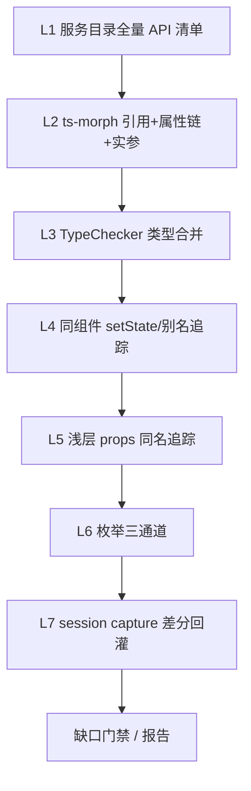
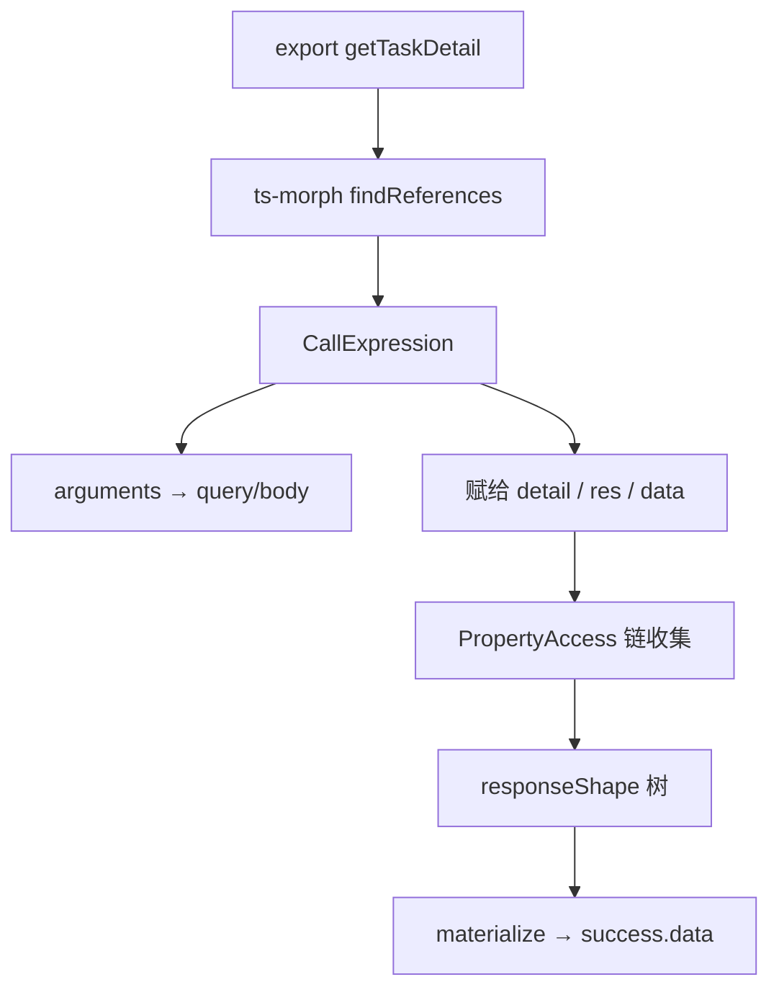

# 修复接口反推空 Mock（ts-morph 用法分析，不依赖 src/mock）

## 关于「能否保证项目内无遗漏」

**不能承诺 100% 零遗漏。** 静态分析在原理上无法穷尽动态语言用法；任何「保证无漏」都不诚实。

定稿目标改为：

1. **在可静态解析的用法上尽量不漏**（引用、字面量键、静态属性链、TS 类型、字面量枚举比较）。
2. **把不可证全的部分显式标成 gap**，写入 init/coverage 报告，避免 silent 空 `data: {}` 假装完备。
3. **运行时补洞**：既有 soft proxy `captures/` 在自测流量里补静态没看到的字段/枚举（二次 merge），不替代用法主路径。

### 能较好覆盖（高召回目标）

| 类别 | 可覆盖形态 |
|------|------------|
| 请求参数 | `api({ a, b })` 对象字面量；同文件变量初始化后再传入；GET/POST 按 method 分流 |
| 响应字段 | `res.data.x`、解构、`const d = await api(); d.x.y`、setState 后再读属性（同符号引用） |
| 枚举/状态 | `status === 1` / `=== 'OK'`、`switch(status)` case、`as const` 对象、TS union/enum 关联到已知字段 |
| 路径 | env serviceBase + createRequest 拼接后的完整 host+path |

### 必然或高概率盲区（不伪装能解）

| 盲区 | 例子 |
|------|------|
| 动态键 | `params[key]`、`data[fieldName]`、`obj[calc()]` |
| 深 prop 钻透不全 | 只把 `detail` 作 props 传到子组件，子组件里才读字段（需额外 props 追踪；首期做一层 props 名同名启发，不保证跨多层） |
| 无用法字段 | 后端有、前端从未读的字段 → 用法反推**不可能**出现 |
| 弱类型黑洞 | 全程 `any` 且只 `JSON.stringify(res)` / 透传，无属性访问 |
| 动态 URL | 模板字符串拼 path、配置中心下发 path |
| 跨包实现 | monorepo 外未纳入 Project 的依赖源码 |
| 枚举未贴字段 | 魔法数字出现在无关表达式，无法证明属于某 response 字段 |

### 完备性度量（交付物，替代「口头保证」）

每个 API 的 contract 增加 `coverage`：

```json
{
  "coverage": {
    "request": { "keysFound": ["taskId"], "dynamicKeyRisk": false, "confidence": "high|medium|low" },
    "response": { "pathsFound": ["creatorReview.status"], "confidence": "high|medium|low" },
    "enums": [{ "field": "status", "values": [0, 1], "source": "comparison|switch|ts-union" }],
    "gaps": ["dynamic_key", "any_passthrough", "no_property_access"]
  }
}
```

init 报告汇总：`usageBackedCount` / `emptyDataCount` / `enumBackedCount` / `gapApis`。  
存在 `gaps` 时不得宣称完备；引导补类型或跑 session + capture merge。

### 如何「尽量不遗漏」（多层召回，定稿）

目标不是口头保证，而是把召回做成**可叠加的防御层**：一层漏了，下层还能补。



| 层 | 做什么 | 防的漏 |
|----|--------|--------|
| **L1 清单完备** | 以 `services/**` + `createRequest`/`uri` 导出为 API 全集；页面未调用的也进清单（标 `no_callsite` gap，而不是漏接口） | 漏接口本身 |
| **L2 引用+属性链** | 导出符号 `findReferences` → Call 实参 / 赋值接收者 → `PropertyAccess` 链 | `data.xx.yy`、间接变量 |
| **L3 类型合并** | 有非 any 的入参/返回类型则 `getApparentProperties` 并入 shape（用法 ∪ 类型） | 用法少但类型全的字段 |
| **L4 别名/state 追踪** | 追踪 `res`→`res.data`→`setDetail`→`detail`；同函数/同文件内所有根绑定上的属性访问合并 | setState 间接 |
| **L5 浅 props** | 若 `detail` 作为 JSX prop 传入子组件（同名或 `data={detail}`），在子文件再跑一轮属性收集（深度默认 2） | 跨组件读字段 |
| **L6 枚举三通道** | ①字段上的 `===`/`switch` ②TS union/enum ③同名 `XxxStatus`/`STATUS_MAP` 常量对象键值；合并去重写入 `enums` 与多 case | 状态值漏 |
| **L7 运行时回灌** | `session` soft 下对命中/透传响应做 JSON 形态 diff，**merge 进 contract**（只增不盲删；来源标 `capture`）；建议 init 后至少走一遍主路径自测 | 动态键、any 透传、静态看不到的字段 |
| **门禁** | init/session 结束输出 gap 列表；`emptyDataCount>0` 或高风险 gap → Skill 要求处理（补调用点类型 / 再测 / 人工确认），禁止「已完成」空话 |  silent 空壳 |

操作规程（写入 SKILL / init 下一步）：

1. `mock-skill init`（L1–L6）  
2. 打开报告，处理 `gapApis`（能补类型就补，补完再 init）  
3. `mock-skill session start` 走主链路（L7 自动 merge）  
4. `mock-skill smoke` + 再看 coverage；枚举 case 是否齐  

这样「尽量不遗漏」= **静态最大化 + 类型补强 + 运行时闭环 + 缺口强制可见**，而不是单次扫描赌命。

## 决策锁定

- **主数据源**：业务调用点用法（含赋值变量后的 `detail.xx.yy`）。
- **分析引擎定稿**：[ts-morph](https://ts-morph.com/)（引用查找 + 属性链 + TypeChecker），不用手写正则冒充数据流分析。
- **不依赖** `src/mock`；**不承诺**静态零遗漏；**承诺**缺口可观测、可补洞。

网上已有、计划直接采用的能力（不必自研）：

| 能力 | ts-morph API | 解决的用法 |
|------|----------------|------------|
| 跨文件找引用 | `symbol.findReferences()` / `findReferencesAsNodes()` | `getTaskDetail` 在页面里被 import 后调用 |
| 属性访问链 | `SyntaxKind.PropertyAccessExpression` 向上收链 | `detail.creatorReview.status`、`data.list.length` |
| 调用实参 | `CallExpression.getArguments()` | `api({ taskId, cityId })` |
| 解构 | `BindingElement` / `ObjectBindingPattern` | `const { list, total } = res` |
| 有类型时读 shape | `Project.getTypeChecker()` + `type.getProperties()` | TS 标注过的返回值/入参 |

参考文档：[Finding References](https://ts-morph.com/navigation/finding-references)、[Type Checker](https://ts-morph.com/navigation/type-checker)、[Types](https://ts-morph.com/details/types)。

## 问题定性（不变）

env 基址 `CARS_TASK: 'https://.../cars-task'` 被当成接口；真实为 `createRequest({key}) + "/external/..."`；IO 空是因为未追踪「赋值变量 → 后续属性访问」。

典型 jian-h5：

```ts
const [detail, setDetail] = useState({});
// ...
getTaskDetail(...).then((res) => setDetail(res.data ?? res));
// 之后 detail.xxx / detail.yyy.zzz
```

正则扫 URL 得不到这些字段；需要 **引用图 + 属性链**。



## 实现策略

只改 [`/Users/xuwei/Profession/mock`](/Users/xuwei/Profession/mock)。依赖：`ts-morph`（加入根 `package.json`）。

### 1. 服务基址过滤（可保留轻量扫描）

`discoverServiceBases`：env/`KEY: 'https://host/prefix'` → 禁止生成 pathname 深度 ≤ 1 的假接口；过滤静态资源后缀。

### 2. createRequest 拼完整 URL

映射 `createRequest({ key })` → `host + prefix + uri`（仍可用 AST/正则在 service 文件完成；路径正确是 IO 反推的前提）。

### 3. 核心：`scripts/infer-usage-io.js`（ts-morph）

对每个已识别 API 的 **导出符号**（如 `getTaskDetail`）：

1. `Project`：优先读目标仓 `tsconfig.json`；无则 `skipAddingFilesFromTsConfig` + 加入 `src/**/*.{ts,tsx,js,jsx}`。
2. 定位 export 声明 → `findReferencesAsNodes()`。
3. 对每个引用父级：
   - **CallExpression**：收集 ObjectLiteral 实参键 → `queryHints`/`bodyHints`（按 method 分流）；Identifier 实参则跟到同作用域初始化字面量。
   - **赋值 / setState**：记录接收绑定名（`detail`、`res`、`data`）。
4. 在引用所在 SourceFile（及同组件函数作用域）收集 PropertyAccess：
   - 若根标识符是该接收绑定（或 `res.data` 再解一层），把链 `a.b.c` 写入 `responseShape`。
5. 若 `getType()` 有非 `any`/`error` 结构，合并 `type.getApparentProperties()` 字段（增强，不替代用法链）。
6. **枚举收集**（绑定到已知 shape 字段）：
   - 对链尾字段 `status`：在同作用域找 `BinaryExpression`（`===`/`!==`/`==`）与 `SwitchStatement` case 字面量；
   - TS union / enum 成员并入 `enums[]`；
   - 写入 field.enums，并为 `cases` 生成多状态（每个枚举值一个 case，或 `state_<value>`），不仅只有 success/empty/biz_error。
7. 输出含 `coverage`（见上节）；`gaps` 非空则 confidence 降为 medium/low。

性能：每项目一次 `Project`；只对导出 API 符号 `findReferences`。

### 4. generate / init

- `materialize(responseShape)`；枚举字段优先用收集到的值
- 多 case：用法枚举 → `cases[]`；缺口接口不假装完备
- `--force` 删 gateway-only 遗留
- 报告：`gatewayFilteredCount` / `usageBackedCount` / `enumBackedCount` / `emptyDataCount` / `gapApis`

### 5. jian-h5 回归

```bash
cd /Users/xuwei/Guazi/jian-h5 && mock-skill init --force --name=jian-h5
```

验收：

1. 无 `mocks/**/cars-task/index.js`
2. 有完整 `.../cars-task/external/review/task/detail/index.js`
3. 有 `detail.xxx` 用法的接口，`success.data` 含属性链字段
4. 有 `status === …` 等比较的字段，contract.enums / 多 case 有值
5. 报告出现 `coverage`/`gapApis`，不宣称 100% 完备
6. 不读 `src/mock/**`

## 主要改动文件

- [`package.json`](/Users/xuwei/Profession/mock/package.json) — 加 `ts-morph`
- 新 [`scripts/infer-usage-io.js`](/Users/xuwei/Profession/mock/scripts/infer-usage-io.js) — ts-morph 引用/属性链
- [`scripts/infer-api-usage.js`](/Users/xuwei/Profession/mock/scripts/infer-api-usage.js) — bases + createRequest；调用 infer-usage-io
- [`scripts/generate-mock.js`](/Users/xuwei/Profession/mock/scripts/generate-mock.js) — materialize shape
- [`scripts/init-project.js`](/Users/xuwei/Profession/mock/scripts/init-project.js) — 清理与报告
- [`references/infer-from-usage.md`](/Users/xuwei/Profession/mock/references/infer-from-usage.md) — 写明 ts-morph 管线

## 不在本次范围

- `src/mock` 灌数、自研完整数据流引擎、HTTPS MITM、改 jian-h5
